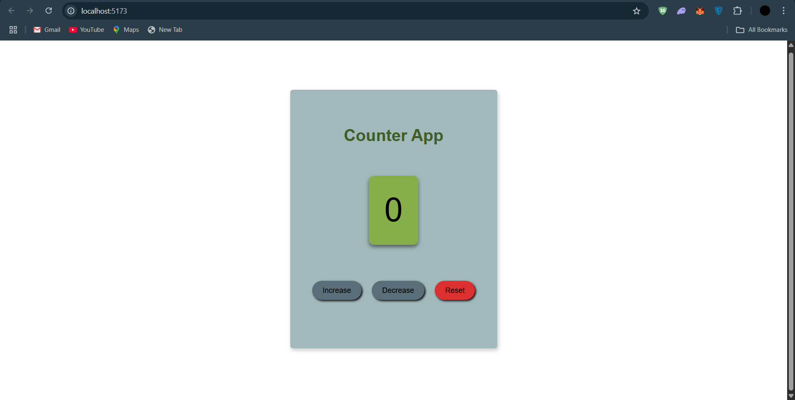

# 🧮 React Counter App

🔗 **Live Demo**: [Click to view](https://counter-app-seven-lilac.vercel.app/)

A simple and stylish counter app built using **React** and **Vite**. This app allows users to increment, decrement, and reset a counter value. It's a beginner-friendly project and a great way to get started with React fundamentals and CSS styling.



## 🔧 Features

- Increase, Decrease, and Reset counter value
- Clean and responsive UI
- Button with shadows
- Built using modern tools (React + Vite)

## 🛠️ Built With

- [React](https://reactjs.org/)
- [Vite](https://vitejs.dev/)
- HTML & CSS

## 📸 Preview

| Action        | Screenshot |
|---------------|------------|
| App Interface |  |

## 🚀 Getting Started

Clone the repository and run it locally:

```bash
git clone https://github.com/yourusername/react-counter-app.git
cd react-counter-app
npm install
npm run dev
